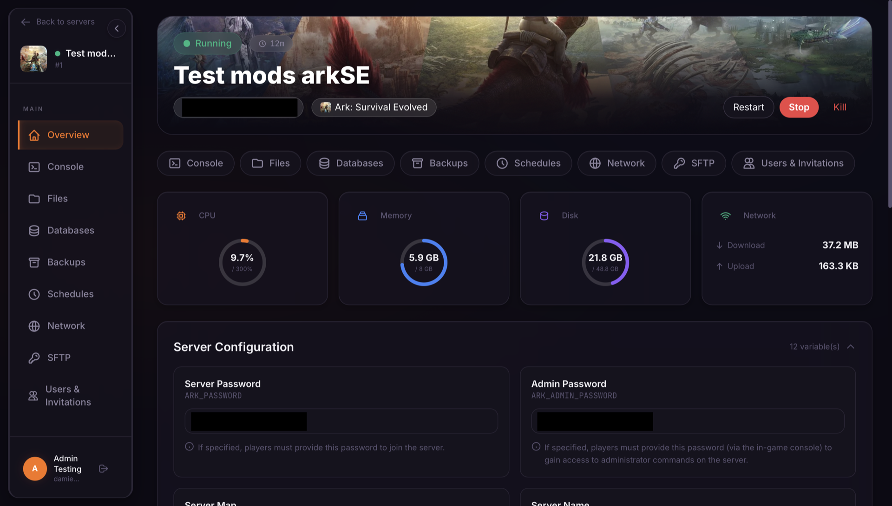
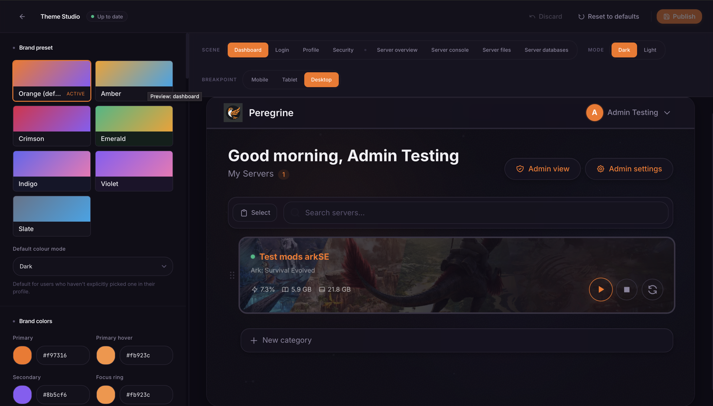
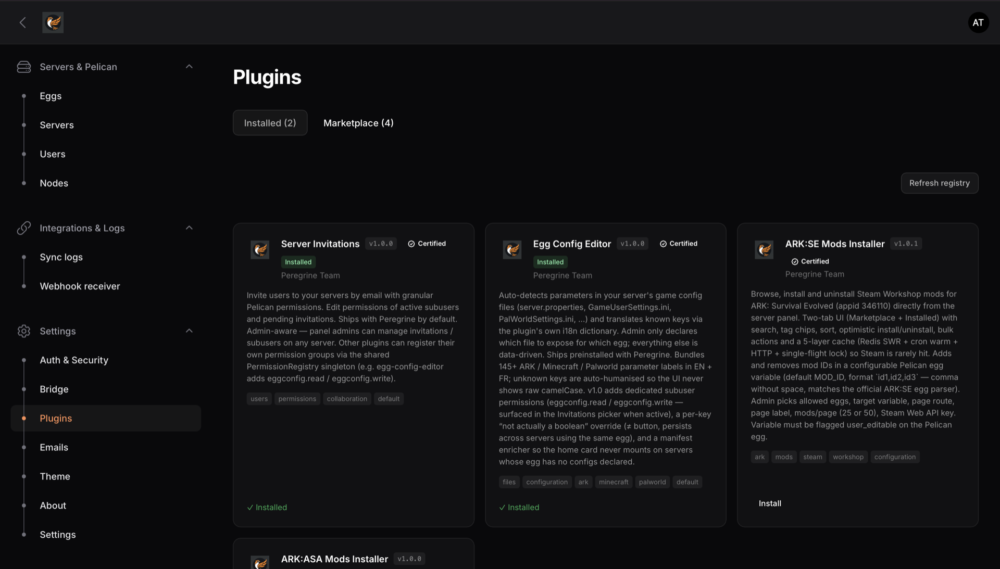

<div align="center">
  

  <h1>Peregrine</h1>
  <p><strong>The open-source game-server panel that gives <a href="https://pelican.dev">Pelican</a> the player UX, admin tooling, and customisation it deserves.</strong></p>

  <p>
    <a href="https://github.com/Knaox/Peregrine/releases"></a>
    <a href="https://github.com/Knaox/Peregrine/blob/main/LICENSE"></a>
    <a href="https://github.com/Knaox/Peregrine/actions/workflows/docker.yml"></a>
    <a href="https://github.com/Knaox/Peregrine/pkgs/container/peregrine"></a>
    
    
    
  </p>

  <p>
    <a href="#-screenshots">Screenshots</a> ·
    <a href="#-why-peregrine">Why Peregrine?</a> ·
    <a href="#-quick-start-docker">Quick start</a> ·
    <a href="#-features">Features</a> ·
    <a href="#-theme-studio">Theme Studio</a> ·
    <a href="#-plugin-marketplace">Plugins</a> ·
    <a href="#-roadmap">Roadmap</a>
  </p>

  <p><a href="README.fr.md">🇫🇷 Lire en français</a></p>
</div>

---

## What is Peregrine?

**Peregrine is a modern control panel for game servers.** It speaks to [Pelican](https://pelican.dev) (the actively-maintained fork of Pterodactyl) over its API and wraps it in:

- a **React 19 player SPA** with WebSocket console, full file manager, SFTP, databases, backups, schedules, network and subuser invitations,
- a **Filament 5 admin panel** for users / servers / plans / eggs / nodes — with one-click Pelican sync,
- a **Theme Studio** with live split-screen preview to fully rebrand the panel without touching code,
- a **Plugin Marketplace** backed by a public GitHub registry — install / update / uninstall in one click,
- **Docker-first**, multi-arch image published to GHCR on every push to `main`,
- bilingual **EN / FR** UI, every string translated.

It runs **standalone** for a single hoster, or wired to a SaaS shop via OAuth2 SSO + Stripe webhook bridge for full subscription-driven provisioning.

---

## 📸 Screenshots

<table>
  <tr>
    <td colspan="2" align="center">
      <a href="docs/screenshots/server-overview.png"></a>
      <br/><sub><strong>Server overview</strong> — live CPU / RAM / disk / network via Wings WebSocket, quick power controls, banner image.</sub>
    </td>
  </tr>
  <tr>
    <td width="50%" align="center" valign="top">
      <a href="docs/screenshots/theme-studio.png"></a>
      <br/><sub><strong>Theme Studio</strong> — split-screen live preview, 7 brand presets, ~60 tokens, login templates, per-page overrides.</sub>
    </td>
    <td width="50%" align="center" valign="top">
      <a href="docs/screenshots/plugins-marketplace.png"></a>
      <br/><sub><strong>Plugin Marketplace</strong> — browse, install, activate, update, uninstall — backed by a public GitHub registry.</sub>
    </td>
  </tr>
</table>

---

## 🦅 Why Peregrine?

Pelican already does the heavy lifting on the daemon side. Peregrine is what sits **on top** of it, for the people who actually use the panel every day.

| | Pelican panel (default) | **Peregrine** |
|---|---|---|
| Player UX | Functional, classic | Modern React SPA, dark/light, mobile-friendly |
| File manager | Basic | Full parity (chmod, pull, drag-drop, bulk, archives) |
| Customisation | CSS overrides | **Theme Studio** with live preview — no code |
| Plugins | None first-party | **Marketplace** backed by a public GitHub registry |
| Subuser invitations | Manual | First-class plugin, granular permissions, email |
| SSO / Billing bridge | None | OAuth2 + Stripe + Pelican webhook bridge |
| i18n | EN | EN + FR (every string), pluggable |
| Deploy | Multi-step | `docker compose up -d` → 7-step browser wizard |

If you run a hosting business or want to give your community a panel that doesn't feel like a 2014 admin form, Peregrine is for you.

---

## ⚡ Quick start (Docker)

> The heavy lifting happens in your browser. After the container starts, open port 8080 and a **7-step Setup Wizard** walks you through language, database, admin account, Pelican credentials, auth mode, optional Bridge, and summary. You never touch `.env` manually.

Two compose files ship in the repo, and that's it:

| File | When to use it |
|---|---|
| **[`docker-compose.yml`](docker-compose.yml)** *(default)* | All-in-one — bundled MySQL 8.4 + Redis. Turnkey production install. |
| **[`docker-compose.external-db.yml`](docker-compose.external-db.yml)** | You already run a managed MySQL / MariaDB / PostgreSQL elsewhere — keep it, get bundled Redis. |

### Option A — all-in-one (recommended)

```bash
curl -fsSLO https://raw.githubusercontent.com/Knaox/Peregrine/main/docker-compose.yml
docker compose up -d
open http://localhost:8080
```

Works as a Portainer Stack — paste the compose, click Deploy. The Setup Wizard pre-fills the database step with `mysql` / `peregrine` / `peregrine` (override `DB_PASSWORD` at deploy time).

### Option B — bring your own database

```bash
curl -fsSLO https://raw.githubusercontent.com/Knaox/Peregrine/main/docker-compose.external-db.yml
# Set DB_HOST / DB_DATABASE / DB_USERNAME / DB_PASSWORD via .env or Portainer env vars
docker compose -f docker-compose.external-db.yml up -d
open http://localhost:8080
```

### What runs inside the container

A single image, supervised by `supervisord` and auto-restarted on crash:

- **`nginx`** — HTTP server on port 8080
- **`php-fpm`** — PHP 8.3 worker pool
- **`php artisan queue:work`** — processes Bridge / Stripe / Pelican-mirror webhooks, plugin emails, sync jobs

**No separate worker container, no host-level supervisor / systemd setup needed.**

### Option C — bare metal (no Docker)

```bash
git clone https://github.com/Knaox/Peregrine.git && cd Peregrine
composer install --no-dev --optimize-autoloader
pnpm install && pnpm run build
cp .env.example .env && php artisan key:generate && php artisan storage:link
php artisan serve &                   # HTTP on :8000
php artisan queue:work --daemon &     # mail + sync jobs
```

Reverse-proxy with nginx / Caddy / Traefik as you normally would.

---

## ✨ Features

### Player panel (React 19 SPA)
- **Overview** — live CPU / RAM / disk / network via Wings WebSocket, uptime, banner image, quick actions gated by permissions.
- **Console** — xterm.js terminal, persistent command history, Start / Stop / Restart / Kill with granular `control.*` gating.
- **File manager** — full Pelican parity: list, read, edit, write, rename, delete, copy, compress, decompress, `chmod` (octal), remote URL `pull`, drag-and-drop upload, folder creation, bulk actions. Read-only mode for users without `file.update`.
- **SFTP** — credentials panel, clipboard copy, separate SFTP password reset.
- **Databases** — create, rotate password, delete, view credentials.
- **Backups** — create, download, lock, restore, delete.
- **Schedules** — cron presets + advanced editor, run-now, task management.
- **Network** — allocations list, notes, primary, bulk delete, add.
- **Invitations** (shipped plugin) — invite users by email with granular permissions, edit pending and active subusers.

### Admin panel (Filament 5)
- Resources: Users, Servers, Plans, Eggs, Nests, Nodes — one-click Pelican sync.
- **Settings** — app name, logo, favicon, custom header links, Pelican credentials, auth mode, bridge.
- **Email templates** — per-locale subject + HTML body, variable placeholders, automatic favicon-as-logo.
- **About & Updates** — live GitHub release check, Docker-aware update commands with one-click clipboard copy.

### Platform
- **Strict permissions** — every Pelican subuser permission key maps to a dedicated policy ability. UI hides what users can't do; API returns 403 if they try anyway.
- **Multi-provider auth** — local, OAuth2 (SaaSykit-compatible Shop, Paymenter), Google, Discord, LinkedIn — coexist, configurable from `/admin/auth-settings`. Native 2FA TOTP with admin enforcement option.
- **Redis caching** — branding, theme, allocations, SFTP credentials, backup/database/schedule lists, settings.
- **Queue-safe** — plugin Mailables never get serialised into the queue.
- **Bilingual EN + FR** — every new string lands in both i18n files, same commit.
- **Multi-arch image** — `linux/amd64` + `linux/arm64`, auto-built on every push to `main`.

---

## 🎨 Theme Studio

A full-screen, admin-only React studio at `/theme-studio` with **live split-screen preview** — edit on the left, see your panel update in real time on the right. Reachable from Filament → **Settings → Appearance → Open Theme Studio**.

<div align="center">
  <a href="docs/screenshots/theme-studio.png"></a>
</div>

What you can do without touching a single line of code:

- **7 brand presets** (Orange / Amber / Crimson / Emerald / Indigo / Violet / Slate), each with full dark + light variants.
- **~60 design tokens** — colors, radii, fonts, shadows, density, layout widths, sidebar styles, border widths, hover scale, glass blur, transition speed, font scale.
- **4 login templates** (Centered / Split / Overlay / Minimal) with image upload and 8 background patterns.
- **Per-page overrides** — fullwidth console, fullwidth file manager, 4-column dashboard.
- **Sidebar configurator** — widths, blur, floating, classic/rail/mobile, custom nav entries with reordering.
- **Footer builder** — toggle, free text, list of links.
- **Live preview toolbar** — switch between 8 scenes (4 user pages, 4 server pages), toggle dark/light, change breakpoint (mobile / tablet / desktop).
- **Asset uploads** — drag-drop your login background straight into the studio.
- **Custom CSS escape hatch** — for the 1% the tokens don't cover.

Settings are stored in the `settings` table (cached in Redis 1 h) and rendered as CSS variables on every page. Reset to factory defaults in one click.

---

## 🧩 Plugin Marketplace

Peregrine has a real plugin system — not theme overrides or hooks. Plugins are mini React + Laravel apps that can register routes, navigation entries, permissions, settings schemas and Filament resources.

<div align="center">
  <a href="docs/screenshots/plugins-marketplace.png"></a>
</div>

### Marketplace registry

Public, GitHub-hosted registry at **[`Knaox/peregrine-plugins`](https://github.com/Knaox/peregrine-plugins)**. Peregrine fetches the latest `registry.json` from `raw.githubusercontent.com`, lists available plugins in **Admin → Plugins → Marketplace**, and handles **install / activate / deactivate / update / uninstall** in one click.

### Shipped by default

- **Server Invitations** — invite players to your servers by email with granular Pelican permissions, edit pending invites and active subusers, self-protection against locking yourself out, queue-safe email dispatch.

### Bring your own

```bash
php artisan make:plugin my-plugin
```

Scaffolds `plugins/my-plugin/` with a service provider, manifest, migrations folder, and a React entry point. See [`plugins/invitations/`](plugins/invitations/) for the reference implementation, and [`docs/plugins.md`](docs/plugins.md) for the full plugin developer guide.

Run a private registry by setting `MARKETPLACE_REGISTRY_URL` in your `.env`.

---

## 🧾 Configuration

Everything is configured **through the browser** during the 7-step Setup Wizard. The only `.env` value you set manually before the first boot is `APP_URL` (it's the absolute base URL for emails, OAuth callbacks and the update checker).

The wizard writes:

| Step | Writes |
|---|---|
| Database (live-tested) | `DB_*` vars |
| Admin account | First admin user |
| Pelican (live-tested) | `PELICAN_URL`, `PELICAN_ADMIN_API_KEY`, `PELICAN_CLIENT_API_KEY` |
| Auth mode | Local / OAuth2 / Social providers, all configurable post-install too |
| Bridge (optional) | `BRIDGE_ENABLED`, `STRIPE_WEBHOOK_SECRET` |
| Summary | Flips `PANEL_INSTALLED=true`, runs migrations |

Re-run the wizard at any time by setting `PANEL_INSTALLED=false`. Existing data is preserved.

See [`.env.example`](.env.example) for the full list of recognised variables.

---

## 🔄 Updates

Admin → **About & Updates** shows the installed version, checks GitHub for the latest panel release (plugin releases are filtered out), and gives you the exact command with a clipboard button.

```bash
docker compose pull && docker compose up -d
```

Migrations run automatically on container start when `PANEL_INSTALLED=true`.

---

## 🗺️ Roadmap

Shipped (latest: `v1.0.0-alpha.1`):

- ✅ Player React SPA — full Pelican file-manager parity, console, SFTP, databases, backups, schedules, network
- ✅ Filament 5 admin panel with Pelican sync
- ✅ Theme Studio (Vagues 1 + 3 + parity + refinements)
- ✅ Plugin Marketplace + Server Invitations plugin
- ✅ Multi-provider auth (local / Shop / Paymenter / Google / Discord / LinkedIn) + 2FA TOTP
- ✅ Stripe + Pelican webhook bridge for subscription-driven provisioning
- ✅ Docker multi-arch image published to GHCR on every push

Up next:

- 🛠️ **Theme marketplace** (Theme Studio Vague 4) — share / import / export themes as JSON, fork a preset, public registry mirroring the plugin marketplace pattern
- 🛠️ **Token system v2** (Theme Studio Vague 2) — color scales 50→950, Material-style type roles, 5 shadow levels, named gradients, per-section background patterns
- 🛠️ **Polish & accessibility** (Theme Studio Vague 5) — live WCAG contrast checker, color-blindness simulator, Monaco editor for custom CSS, per-user appearance overrides

Track progress in [GitHub issues](https://github.com/Knaox/Peregrine/issues) and [milestones](https://github.com/Knaox/Peregrine/milestones).

---

## 🐳 Docker image tags

Multi-arch (`linux/amd64` + `linux/arm64`), published on every push to `main` and on every panel version tag.

| Tag | Produced by |
|---|---|
| `ghcr.io/knaox/peregrine:latest` | push to `main` |
| `ghcr.io/knaox/peregrine:main-<sha>` | push to `main` |
| `ghcr.io/knaox/peregrine:1.2.3` / `:1.2` / `:1` | `v*.*.*` tag |

Workflow: [`.github/workflows/docker.yml`](.github/workflows/docker.yml).

---

## 🧱 Tech stack

| Layer | Choice |
|---|---|
| Backend | PHP 8.3 · Laravel 13 · Filament 5 (Livewire 4) |
| Frontend | React 19 · TypeScript · Vite 6 · Tailwind 4 · TanStack Query · React Router 7 · Motion |
| Database | MySQL 8 (SQLite supported) |
| Cache / Queue | Redis (database fallback) |
| Real-time | Wings WebSocket + xterm.js |
| Container | Docker multi-stage · GHCR · nginx + php-fpm + supervisord |

---

## 🛠 Developing locally

```bash
composer install
pnpm install
pnpm run dev            # Vite HMR on :5173
php artisan serve       # PHP on :8000
php artisan queue:work  # emails + sync jobs
```

Full contributor guide in [`CONTRIBUTING.md`](CONTRIBUTING.md). Internal architecture notes in [`docs/`](docs/) (auth, bridge, plugins, Pelican webhooks, queue worker setup).

---

## 🔒 Security

If you find a vulnerability, **do not open a public issue**. See [`SECURITY.md`](SECURITY.md) for the responsible disclosure process.

---

## License

[MIT](LICENSE). Self-host freely, fork, modify, resell — no strings.

Peregrine is an independent project and is **not affiliated with Pelican, Pterodactyl, or Laravel**.

---

## Credits

Built on top of [Pelican](https://pelican.dev), [Laravel](https://laravel.com), [Filament](https://filamentphp.com), [React](https://react.dev), [Tailwind](https://tailwindcss.com), and the open-source community that makes all of this possible.
